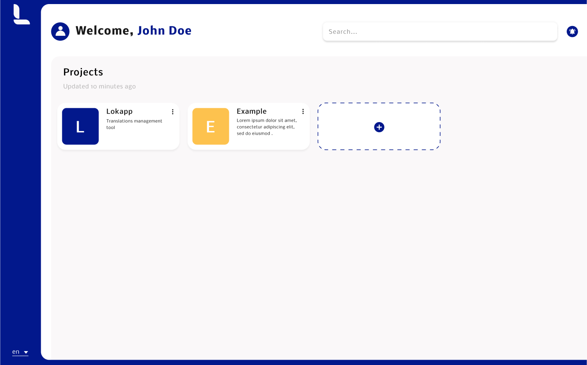

# Lokapp - Docker Compose

<p align="center">
   <a href="https://www.lokapp.io/">
     
   </a>
</p>

[](https://lokapp.io)

Docker compose created to generate your own Lokapp, based on our [API](https://github.com/lokappio/lokapp-api) and our [web client](https://github.com/lokappio/lokapp-client).

## Table of contents

* [About the project](#about-the-project)
* [Getting started](#getting-started)
* [Usage](#usage)



## About the project

This Docker compose provides you a complete Lokapp project with our <a href="https://github.com/lokappio/lokapp-api">Lokapp API</a> and our <a href="https://github.com/lokappio/lokapp-client">Lokapp Client</a> to easily manage the translations of your projects.

## Getting Started

### Installation

1. Get Docker
2. Clone this project

### Environment Variables

To run the Docker, you need to add the environment variables to your `.env` file.
To do this, you can replace the values of the `.env.sample` file with your values and rename it to `.env`.


## Usage

### Locally

```
docker compose up
```
Once the site is up and running, go to [http://localhost:8080/](http://localhost:8080/).

## License

Distributed under the Apache 2.0 License. See `LICENSE` for more information.


## Acknowledgements

<a href="https://playmoweb.com/">
  
</a>

*Lokapp* is built by [Playmoweb](https://playmoweb.com), a mobile agency building web apps and native Android and iOS applications.
